<p align="center">
  
</p>

<p align="center">
  <strong>A desktop <em>and</em> in-cluster client for Kubernetes.</strong>
</p>

<p align="center">
  <a href="https://github.com/buzzwordy/Panope/actions/workflows/ci.yml"></a>
  <a href="LICENSE"></a>
  
</p>

Browse and manage your clusters: live resource tables, drill-down views with
logs, an exec terminal and port-forwarding, every CRD on the cluster, Helm,
ArgoCD, and an AI assistant that can investigate and fix things with your
approval.

Run it on your desktop against your kubeconfig, or deploy it into the cluster
where it serves the same UI behind OIDC login with per-user impersonation.

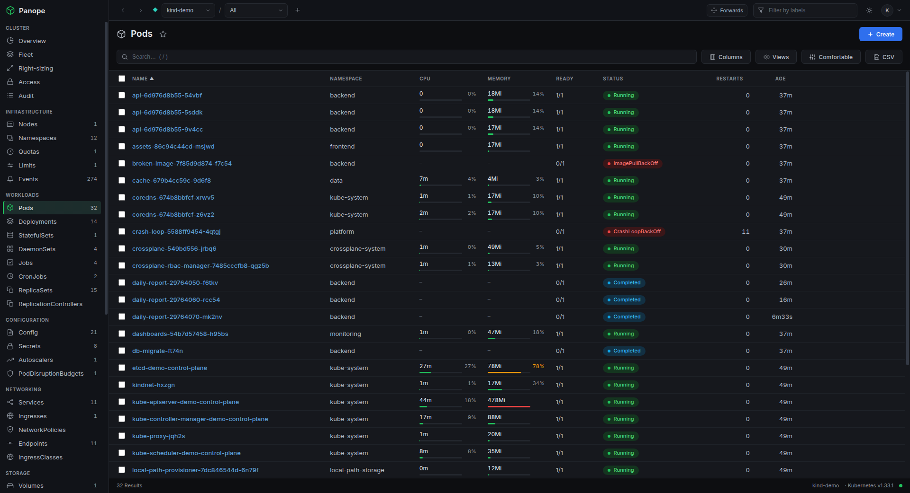

| ArgoCD | YAML editor | Logs |
| --- | --- | --- |
| 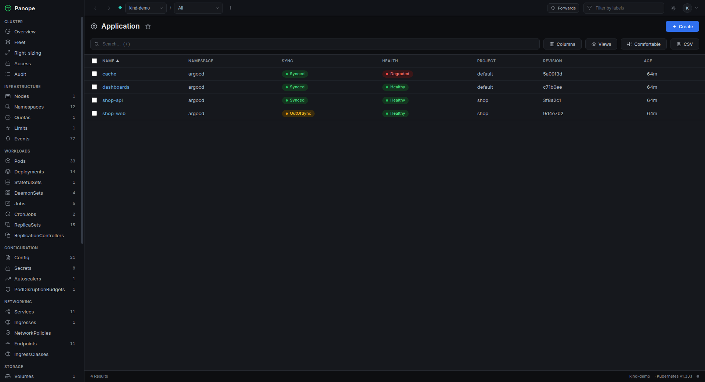 | 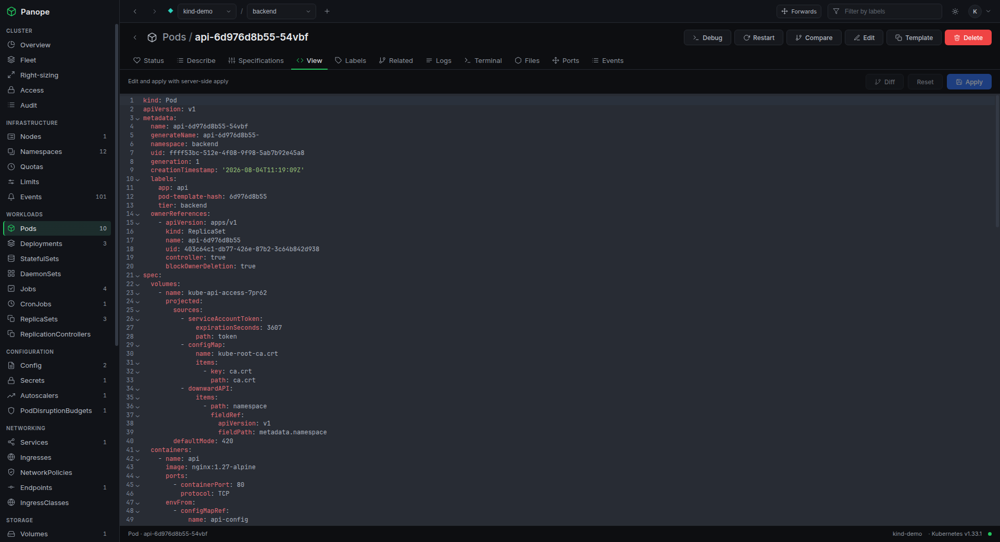 | 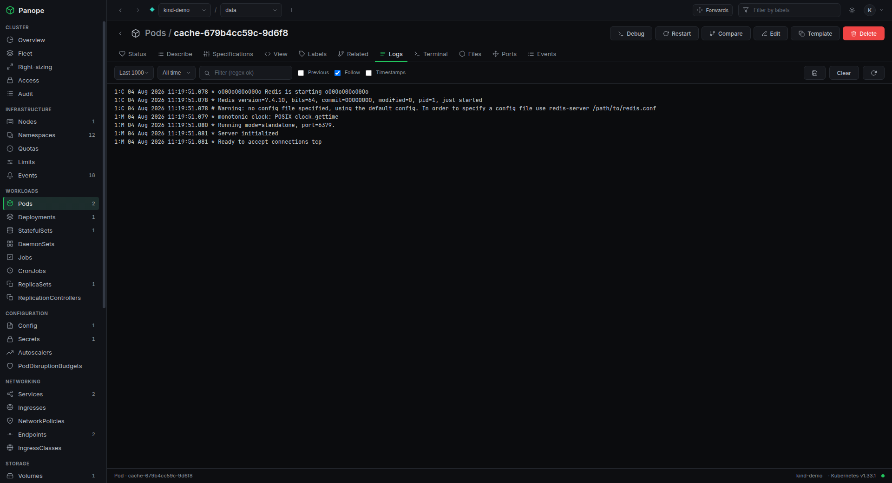 |
| **Terminal** | **Create** | |
| 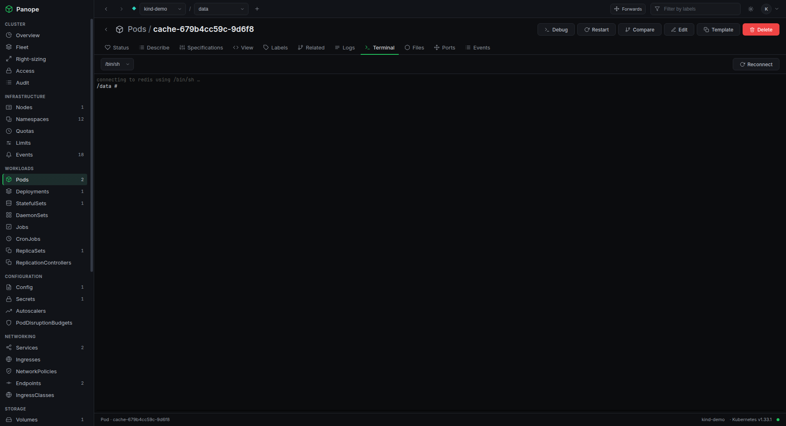 | 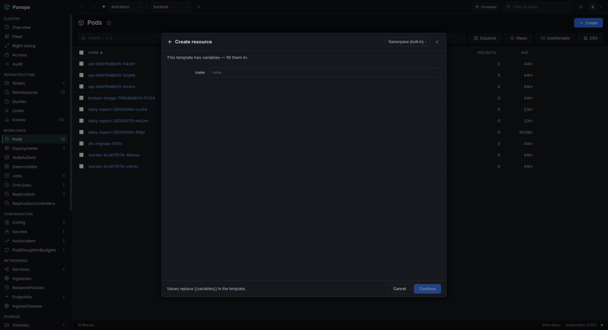 | |

CRDs divided by API group, and automatic port-forwarding:

| CRD groups | CRD group expanded | Port forward |
| --- | --- | --- |
| 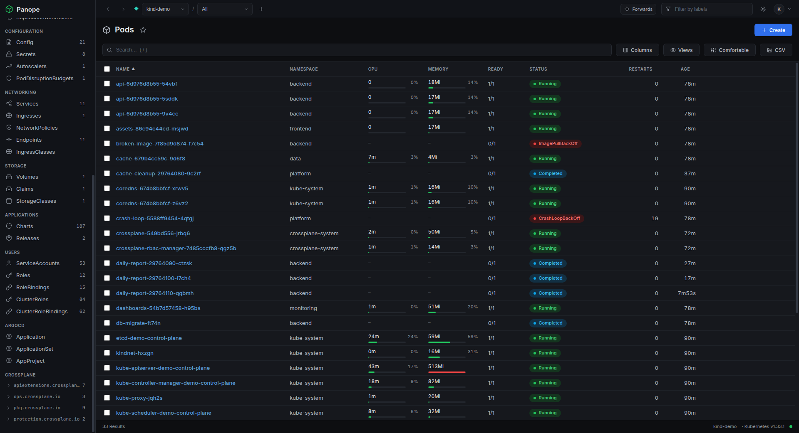 | 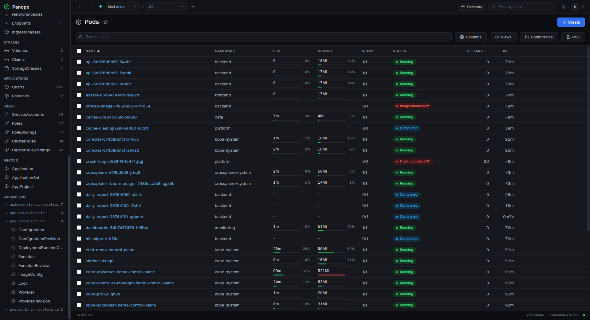 | 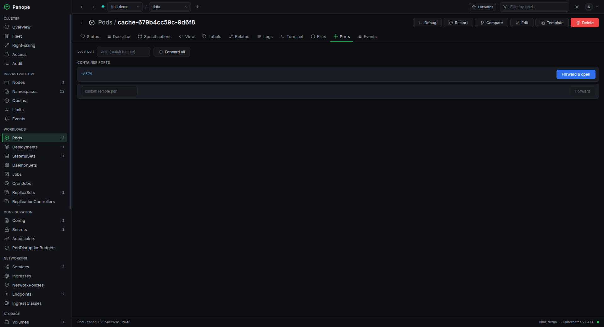 |

Drill-down management in the main area:

| Deployment -> its Pods | Pod management |
| --- | --- |
| 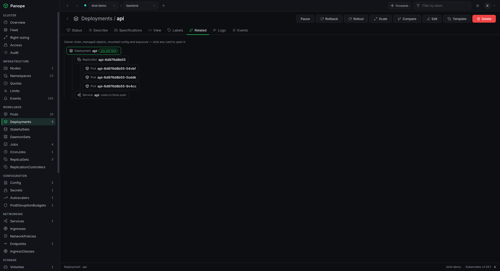 | 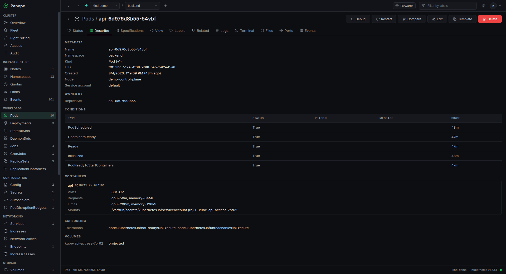 |

## Install

Grab a package from the [latest release](https://github.com/buzzwordy/Panope/releases/latest):

```sh
sudo apt install ./panope_3.1.0_amd64.deb     # Debian / Ubuntu
sudo dnf install ./panope-3.1.0.x86_64.rpm    # Fedora / RHEL
chmod +x Panope-3.1.0.AppImage && ./Panope-3.1.0.AppImage
```

Windows: run `Panope-Setup-3.1.0.exe`, or unzip the portable build. macOS
packages are not built yet.

Packages are unsigned, so Windows SmartScreen warns on first launch.

You need a working `~/.kube/config`. Panope opens on your current context and
you switch contexts from the top bar.

### In the cluster

```sh
helm install panope oci://ghcr.io/buzzwordy/charts/panope
```

Serves the same UI over HTTP with OIDC login, so a team shares one deployment
and every action runs as the logged-in user. See
[docs/in-cluster.md](docs/in-cluster.md) for auth, roles and namespace policy.

## Features

**Browsing**

- 31 built-in resource kinds grouped by category, with live counts in the sidebar.
- Every CRD on the cluster, discovered automatically and split into collapsible
  sections by API group (`longhorn.io`, `monitoring.coreos.com`, ...) instead of
  one flat list. ArgoCD gets its own section with sync and health pills.
- Tables update in real time and reconnect on their own when a watch drops.
- Search, label filters, sortable columns, favorites, and saved views (a named
  filter plus column combination per resource).
- CPU and memory bars for pods and nodes, as a percentage of the limit, request
  or node allocatable rather than an unanchored number. Needs metrics-server.
- Status pills that match kubectl: `CrashLoopBackOff`, `Init:...`,
  `Terminating`, `Completed`, node readiness, PV/PVC/Job phases.

**Working on an object**

Clicking a row opens a full-page view, not a cramped side drawer:

- **Logs** with follow, per-line filter, container switch and timestamps.
- **Terminal** - a real interactive shell with working resize.
- **Ports** - one click forwards and opens the browser; the local port defaults
  to the remote one and falls back to any free port. A manager lists active tunnels.
- **Files** - browse a container's filesystem, download, upload small files.
- **View** - the object as editable YAML, applied with server-side apply.
- **Describe** - the kubectl-describe essentials as one scannable pane.
- **Related** - the object's neighbourhood as a navigable tree: owners, managed
  ReplicaSets and pods, mounted ConfigMaps/Secrets/PVCs, Services and Ingresses.
- Restart, scale, edit and delete from the header, each behind a confirm.

**AI assistant** (desktop)

A side panel that connects to a model three ways: your installed Claude Code CLI
(usage bills to your Claude plan, no API key), the Anthropic API, or anything
OpenAI-compatible (Ollama, vLLM, LM Studio, OpenRouter, OpenAI).

It investigates with 11 read tools (lists, objects, events, logs, metrics, RBAC
checks, Helm history and values) and can act through 10 more (scale, restart,
delete, merge-patch, apply, re-run, drain, cordon, trigger, Helm rollback).

- Every call runs as **you**, through the same impersonated identity as the rest
  of the app. It cannot see or do more than you can.
- Anything that changes the cluster stops at a confirmation card. Approved
  actions respect read-only mode and appear in the audit log as `ai:*`.
- Secret values are replaced with size markers and Helm values with
  credential-like keys are masked before anything leaves your machine. Note that
  credentials you keep in ConfigMaps or inline env values travel like any other
  field.
- Nothing is sent anywhere until you configure a provider. The API key is stored
  locally and never reaches the UI process.

You can also give it tools beyond Panope by adding **MCP servers** (a command to
spawn, or an HTTP endpoint). Their tools show up namespaced as
`ext_<server>_<tool>` so they cannot shadow a Panope tool, and **every external
call stops at a confirmation card** regardless of what the server says about
itself, because Panope cannot verify what a third-party tool does. Tick "always
allow" to stop being asked about one, and revoke that later from the same panel.

Worth knowing before you add one: the assistant already reads untrusted text
(log lines, events and annotations written by workloads). Give it a tool that
can write files or reach the internet and a hostile log line becomes a real
exfiltration path. That is why external tools are off until you add them and
gated once you do.

With the Claude Code provider there is also an **unrestricted mode** that stops
forbidding the CLI's own shell, file and web tools, so it can run `kubectl`,
`git` or anything else on your machine. Those calls happen inside Claude Code,
so they do **not** pass Panope's confirmation card and do **not** appear in the
audit log. It is off by default and the panel says so.

**Beyond one object**

- **Access** - a verb x resource matrix answered by the authorizer itself, plus
  single checks with the reason, and "what could this other user do?".
- **Audit** - every mutation made through Panope. Persisted locally on the
  desktop; in-cluster it is shared per deployment and also written to stdout as
  one greppable `[audit]` line per action.
- **Right-sizing** - usage against declared requests: OOM-killed, near-request,
  wildly overprovisioned, and containers with no requests at all.
- **Fleet** - every kubeconfig context summarised at once.
- **Cross-context diff** - the same object in another context as a unified diff,
  server noise stripped, for finding drift between staging and prod.
- **Helm** - install with default values prefilled, upgrade with a live diff
  against what is running, plus history and rollback.
- **Usage trends** - a rolling in-memory history drawn as sparklines. No
  Prometheus needed.

### Read-only mode

Every instance can run read-only, which blocks mutations, exec and
port-forwarding in the main process. The UI only mirrors that state, so it
cannot be lifted from the renderer.

- Desktop: toggle in Preferences or the top bar; it persists.
- In-cluster: set by the deployment (`PANOPE_READ_ONLY`, or per role in the
  authz policy) and the UI cannot override it.

Kubernetes RBAC is still the real boundary. Panope's own policy only ever
subtracts from what your credentials already allow.

## Architecture

An Electron main process holds all cluster access through
`@kubernetes/client-node`; the React renderer never touches Node or the network
directly and reaches everything over a typed IPC bridge (`contextIsolation: true`,
`nodeIntegration: false`). The in-cluster server exposes that same surface over
RPC and a WebSocket, so both builds share one implementation of every screen.

```
src/
  main/           Electron main process (privileged)
    ipc.ts        handlers + streaming to the renderer
    ai/           assistant: provider clients, tools, MCP endpoint, redaction
    kube/         KubernetesService: kubeconfig, list/get/watch/metrics
  preload/        contextBridge -> window.api
  renderer/       React + TypeScript UI (sandboxed)
  server/         in-cluster HTTP/WebSocket server, OIDC, authz policy
  shared/         types, IPC channel names, resource catalog (both sides)
```

## Develop

```sh
npm install
npm run dev        # electron-vite dev server + hot reload
npm run typecheck
npm test
npm run dist       # package installers
```

If your shell exports `ELECTRON_RUN_AS_NODE=1`, unset it first
(`env -u ELECTRON_RUN_AS_NODE npm run dev`) or Electron starts as a plain Node
process and no window appears. On some Linux GPUs the window renders white; add
`--disable-gpu`.

Releases are cut by pushing a `v*` tag - see [RELEASING.md](RELEASING.md).

## Support

Panope is free and open source. If it saves you time, you can
[buy me a coffee](https://buycoffee.to/buzzwordy).

## License

[GNU AGPL-3.0](LICENSE) © Panope contributors.

The network clause matters here: if you modify Panope and offer it to others
over a network (the in-cluster deployment is exactly that), you must make your
modified source available to those users. Running unmodified Panope, or using it
internally, carries no such obligation.

Commercial licensing is available if the AGPL does not suit your organisation.
